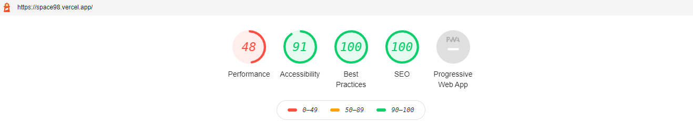

## Overview
This App is built using Next.js and React. Next.js is a framework that makes it easy to create 'universal' React apps - React apps that do both client and server side rendering.

* By default,the app it will open the home component.
* We have three Filters(Year, Launch Success, Land Success) to filter the SpaceX Program List on UI.
* Filters are all configurable and behave like Toggle Button. Applied filters will change the URL and update the Page with latest records without refreshing the page.
* App is developed by following all the best SEO optimization techniques with Server Side Rendering, React Memorization.
* Api call made in the parent level and data served to child component with the help of Props.
* App is targeted for Mobile, Ipad, Desktop.

## Getting Started - Development Server

1. Clone this repo by running git clone https://github.com/shubhangi1412/SpaceX
2. cd SpaceX
3. npm install
4. npm run dev

Open [http://localhost:3000](http://localhost:3000) with your browser to see the result.

## Learn More

To learn more about Next.js, take a look at the following resources:

- [Next.js Documentation](https://nextjs.org/docs) - learn about Next.js features and API.
- [Learn Next.js](https://nextjs.org/learn) - an interactive Next.js tutorial.

You can check out [the Next.js GitHub repository](https://github.com/vercel/next.js/) - your feedback and contributions are welcome!

## Deploy on Vercel

The easiest way to deploy your Next.js app is to use the [Vercel Platform](https://vercel.com/import?utm_medium=default-template&filter=next.js&utm_source=create-next-app&utm_campaign=create-next-app-readme) from the creators of Next.js.

App is Hosted on [SpaceX](https://space-launch-gamma.vercel.app/)

## SEO Report

Lighthouse is an open-source, automated tool for improving the quality of web pages. You can run it against any web page, public or requiring authentication. It has audits for performance, accessibility, progressive web apps, SEO and more. 

